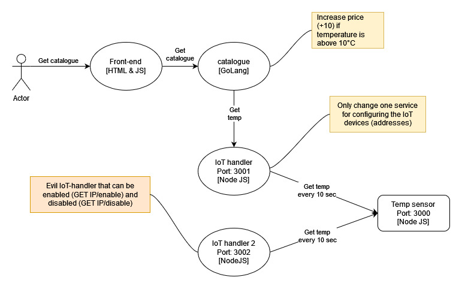

[](https://travis-ci.org/microservices-demo/microservices-demo)

# Adaption to the original Repository
- Change mongoDB version to 4 because of missing AVX support in our environment
- Update prometeus config with a new cadvisor job
- Add additional services from ( https://anonymous.4open.science/r/sock-shop_iot_services-5A36) to include some iot_activity
- Updating the catalog service (https://anonymous.4open.science/r/catalogue-3C6D/) to use the additional IoT-services
- Add a setup file file for setting up the sock-shop and do all the work that is needed for it

Setup commands
Install the microk8s, set up a cluster, enable the addons and set up prometheus
```
chmod +x setup_kubernetes_master.sh
./setup_kubernetes_master.sh
```
Delete the chaos-mesh then the sock-shop environment, activate the istio injection and apply the sock-shop and chaos-mesh again. (Takes approximately 10min)
```
chmod +x setup_environment.sh
./setup_environment.sh
```
Do all the needed port forwardings
```
chmod +x setup_port_forwarding.sh
./setup_port_forwarding.sh
```

## Additional IoT adaption

A temperature sensor is representative for an IoT device in this scenario. In a real environment this IoT device will obviously not be a kubernetes service and therefore not be part of the cluster. To request the data from the IoT device a so called IoT-handler is deployed as a service in the cluster. This service request the temperature in an fix interval and forward this to every service. In this implementation only the catalogue service from the sock-shop environment requires the temperature to adjust the list price of the socks. Additionally, another IoT handler is deployed, which should not be allowed to communicate with the IoT device (based on a MUD file). This service is used to try the RCAwhile a MUD file rule violation.

# Sock Shop : A Microservice Demo Application

The application is the user-facing part of an online shop that sells socks. It is intended to aid the demonstration and testing of microservice and cloud native technologies.

It is built using [Spring Boot](http://projects.spring.io/spring-boot/), [Go kit](http://gokit.io) and [Node.js](https://nodejs.org/) and is packaged in Docker containers.

You can read more about the [application design](./internal-docs/design.md).

## Deployment Platforms

The [deploy folder](./deploy/) contains scripts and instructions to provision the application onto your favourite platform. 

Please let us know if there is a platform that you would like to see supported.

## Bugs, Feature Requests and Contributing

We'd love to see community contributions. We like to keep it simple and use Github issues to track bugs and feature requests and pull requests to manage contributions. See the [contribution information](.github/CONTRIBUTING.md) for more information.

## Screenshot


## Visualizing the application

Use [Weave Scope](http://weave.works/products/weave-scope/) or [Weave Cloud](http://cloud.weave.works/) to visualize the application once it's running in the selected [target platform](./deploy/).


## 
